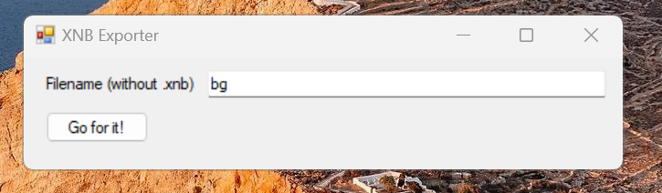

## XNBExporter

- This is simplest desktop xnb2png converter that hase minimal graphical UI. 

Textures only. No sound/music/font support.

## Screenshot(s)

## How-To

1. Place xnb file on XNBExporter folder. For example, "bg.xnb"
2. Type command "bg" (without ".xnb").
3. Click "Go for it!" to start. 
4. Check bg.png at XNBExporter folder.

## ..
No support. DIY.

## .
- mediaexplorer 2024